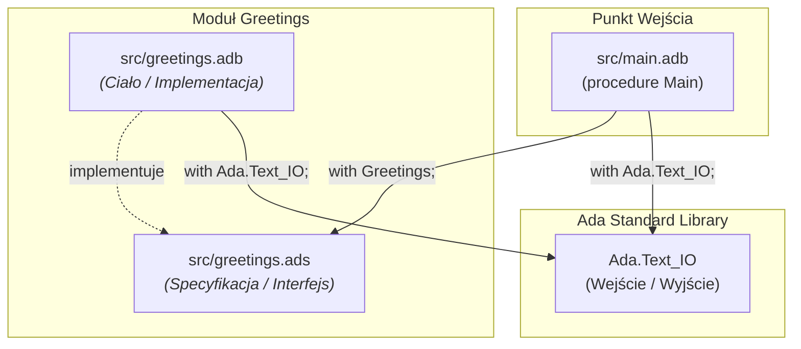
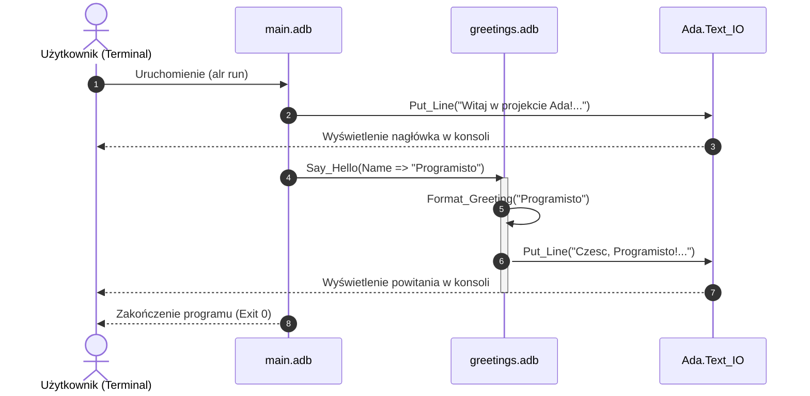

# Projekt w języku Ada

Projekt w języku Ada skonfigurowany pod **Alire** (`alr`).

## Struktura projektu

```text
├── alire.toml           # Konfiguracja pakietu / projektu Alire
├── ada_projekt.gpr      # Plik konfiguracyjny kompilatora GNAT
├── src/
│   ├── main.adb         # Główny punkt wejścia aplikacji
│   ├── greetings.ads    # Specyfikacja pakietu Greetings (nagłówek/interfejs)
│   └── greetings.adb    # Ciało pakietu Greetings (implementacja)
└── .gitignore
```

---

## 🚀 Kompilacja i uruchomienie

Wystarczy wpisać w głównym katalogu projektu:

```bash
alr run
```

Alire automatycznie skompiluje projekt i uruchomi plik wykonywalny.

Inne przydatne polecenia:
* `alr build` – tylko kompilacja
* `alr clean` – czyszczenie plików obiektowych

---

## 📊 Diagramy architektury i przepływu

### 1. Diagram zależności modułów (Architecture Flowchart)



### 2. Diagram sekwencji wywołań (Sequence Diagram)


